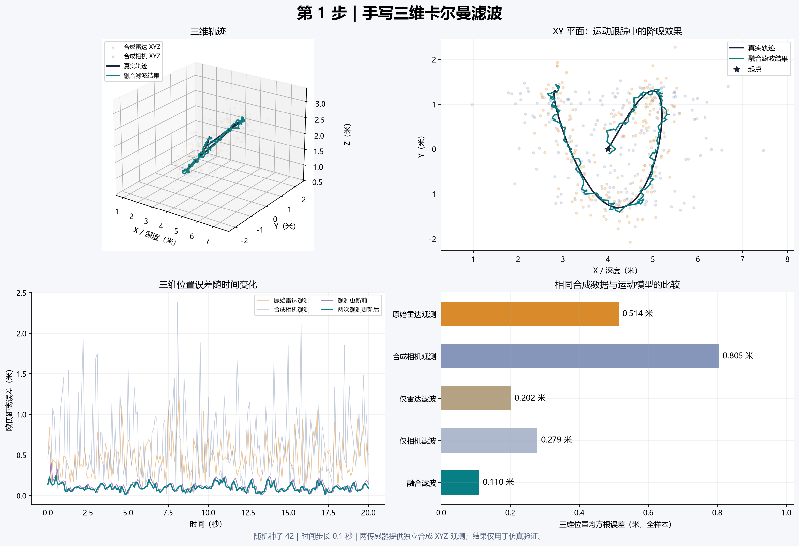
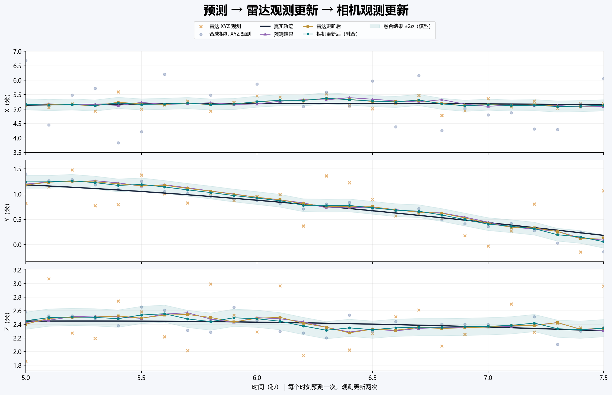

# UAV 雷达与相机融合：逐步论文复现

参考论文：[Data Fusion Approach for Unmodified UAV Tracking with Vision and mmWave Radar](https://doi.org/10.1109/ICUAS65942.2025.11007835)，ICUAS 2025。
本项目是依据论文逐步编写的独立实现，**不是作者官方源码**。论文 PDF 不随代码发布。
已完成第1–5步的算法和合成验证：Kalman、雷达、相机、异步回放、数据导入与统一评价；每步单独提交GitHub并保存说明。
**1.5结果是合成数据验证，不代表论文实测精度。1.6另完成了标定受限的MMAUD真实短片段探索性对照。**

版本1.6：固定9.5秒真实片段，三维RMSE为仅雷达1.082765米、雷达＋相机视线0.179381米，全部50次训练刚体扰动中融合误差较低。条件为**人工辅助视觉＋独立训练GT监督的局部实验投影**；官方完整标定、硬件同步与参考点关系尚未确证，不能作为设备精度或原论文表I逐数复现。D盘本机双击`run_v16.cmd`重跑；[结果解释与中文图](docs/v1_6_results.md)、[详细报告](output/v16_comparison/report.md)、[敏感性](output/v16_comparison/sensitivity_report.md)、[运行与恢复](docs/v1_6_run.md)、[每步记录](docs/v1_6_progress.md)。

1.6表格补充：[每秒位置/速度/方差报告](output/v16_second_table/report.md)、[Excel](output/v16_second_table/outputs/01a11067-689a-71a3-a0e4-e3f048b42212/mmaud_1s_table.xlsx)、[符号和计算方法](docs/v1_6_second_table.md)。t=0–9 s，每秒列两种方法的x/y/z、Vx/Vy/Vz/V、真值位置与V_ref、六项P后验方差。V_ref由真实位置1秒中心差分得到，源数据未直接测速度；符号和SI单位保留英文。

Windows双击`run_reproduction.cmd`运行端到端示例；结果在`output/local_reproduction`。GitHub参考报告见[第5步结果](output/step5/report.md)。

验证：全部62项检查通过；三个种子共33组对比。步骤提交与限制见[复现日志](docs/reproduction_log.md)。

各步骤结果图和报告表格统一使用中文标注。绘图自动选择已安装的中文字体，本机使用微软雅黑；其他系统可安装思源黑体或Noto Sans CJK SC。数值数据的CSV/JSON字段保留原格式。

| 步骤 | 本步做了什么 | 运行和说明 |
|---|---|---|
| 1 | 手写同步三维 Kalman，验证预测和更新 | `python demo_step1.py`，[说明](docs/step1.md) |
| 2 | 两帧初始化、四维雷达门控、五种关联 | `python demo_step2.py`，[说明](docs/step2.md) |
| 3 | 检测框中心、像素回投影、相机坐标与 bearing 模式 | `python demo_step3.py`，[说明](docs/step3.md) |
| 4 | 100Hz预测、异步观测、迟到数据回滚与原始观测重放 | `python demo_step4.py`，[说明](docs/step4.md) |
| 5 | CSV实测入口、五方法与雷达基线、时间插值评价和报告 | `python run_reproduction.py --synthetic`，[说明](docs/step5.md) |

真实输入：`python run_reproduction.py --data data/my_flight`，见[数据格式](docs/data_format.md)。作者原始飞行日志、实际标定、MobileNet训练图/权重及ROS/Coral设备尚未提供，真实精度、检测训练与实机性能复现仍待材料补齐。

新电脑部署：`python -m venv .venv`，`.venv\Scripts\python.exe -m pip install -r requirements.txt`。本机Python及环境已在D盘；固定验证版本见`requirements.lock.txt`，不上传环境或缓存。

下面保留第1步的教学说明，后续各步的参数假设和验证见对应文档。

## 先看效果，再运行

- `output/step1/overview.png`：三维轨迹、XY 平面轨迹、位置误差与 RMSE 对比。
- `output/step1/prediction_update.png`：放大 5–7.5 秒，逐轴查看预测、Radar 更新、Camera 更新。
- 深色线是真值，青色线是融合估计；散点为人工加噪声的观测。
- 曲线图中的青色阴影是滤波器模型给出的 `±2σ`，不是实际误差的保证范围。





当前项目的 `.venv` 已安装运行依赖，在本文件夹的 PowerShell 中执行：

```powershell
.\.venv\Scripts\python.exe demo_step1.py
```

默认生成 20 秒、间隔 0.1 秒的 201 个样本，固定随机种子 `42`。
运行结束会打印误差和前三次预测/更新结果，并重建 `output/step1/` 中的文件。
程序保存图片，不依赖弹出图形窗口。

```powershell
# 运行数学测试
.\.venv\Scripts\python.exe -m unittest discover -s tests -v

# 更符合常速度模型的直线轨迹，结果单独保存
.\.venv\Scripts\python.exe demo_step1.py --trajectory line --output output/step1_line

# 换随机种子，检验不同噪声实现，结果单独保存
.\.venv\Scripts\python.exe demo_step1.py --seed 7 --output output/step1_seed7

# 只跑数值计算和保存数据，不绘图；只需要 NumPy
python demo_step1.py --no-plots --output output/step1_numeric
```

若首次下载项目，在 Python 3.10+ 环境创建虚拟环境（以下为 Windows PowerShell）：

```powershell
python -m venv .venv
.\.venv\Scripts\python.exe -m pip install -r requirements.txt
.\.venv\Scripts\python.exe demo_step1.py
```

原始示例绘图环境为 Python 3.13、NumPy 2.5.3、Matplotlib 3.11.2；依赖范围见 `requirements.txt`。
没有调用 FilterPy、OpenCV Kalman 或其他现成滤波器。

## 这次保留与简化了论文中的哪些部分

对应论文第 3–4 页（印刷页 803–804），IV-A / IV-B，公式 (1)–(15)。

| 部分 | 第1步的处理 |
|---|---|
| 状态与运动模型 | 按论文保留 `[x,vx,y,vy,z,vz]` 与常速度模型 |
| Prediction / Update | 手写矩阵计算，状态与协方差都递推 |
| Radar | 合成 `[x,y,z]`；论文还含 `vx`，本阶段暂不使用速度观测 |
| Camera | **人为构造独立的 `[x,y,z]` 观测**，不是 `(u,v)`，不是单目重建结果 |
| 坐标系 | 假设已经对齐；`x` 为深度方向，单位米 |
| 时间 | 两传感器同步、固定 `dt=0.1 s`；论文滤波输出为 100 Hz，这里用 10 Hz 便于逐步检查 |
| 初始化 | 首个 Radar 位置初始化、速度初值为 0；未实现论文连续两帧最强点的速度筛选 |
| 数据关联 | 已知单目标，每帧只有一个位置；没有点云、门控、Closest |
| 噪声参数 | 论文未给出 `Q/R/P0` 具体数值，以下均为本实验的显式设定 |

真实单目 Camera 没有独立深度。论文后续反投影使用预测深度，该深度与已有状态相关。
不能把本实验的“独立三维 Camera 观测”直接当作真实相机模型。

## 手写滤波器的数学形式

状态和位置观测为：

```text
X = [x, vx, y, vy, z, vz]^T       # m, m/s 交替
z = [x_measured, y_measured, z_measured]^T

F = block_diag(A, A, A),   A = [[1, dt],
                               [0,  1]]

H = [[1, 0, 0, 0, 0, 0],
     [0, 0, 1, 0, 0, 0],
     [0, 0, 0, 0, 1, 0]]
```

每个时间段只执行一次预测：

```text
X_prior = F @ X_previous
P_prior = F @ P_previous @ F.T + Q
```

每收到当前时刻的一条观测，执行一次更新：

```text
innovation = z - H @ X_prior
S = H @ P_prior @ H.T + R
K = P_prior @ H.T @ inverse(S)
X_post = X_prior + K @ innovation
P_post = (I-KH) @ P_prior @ (I-KH).T + K @ R @ K.T
```

上面 `inverse(S)` 只表示数学公式；实际代码用 `np.linalg.solve`，没有显式求逆。
协方差采用 Joseph 形式，与论文公式 (8) 代数等价，数值上更容易维持对称与半正定。
论文没有单列预测协方差公式，这里按标准线性 Kalman 模型补齐。

同一时刻 Radar 更新后的 `X_post/P_post`，直接作为 Camera 更新的输入：

```python
kf.predict(dt)
kf.update(radar_xyz, R_radar)
kf.update(camera_xyz, R_camera)
```

两个 `update()` 之间没有 `predict()`。位置观测仍然可以通过位置/速度的交叉协方差修正速度。
如果某一步没有观测，直接只执行 `predict()` 即可；测试中覆盖了这种情形。

## 参数与模拟数据

两路传感器的误差互相独立、各轴独立、跨时间独立，均为零均值高斯噪声。

| 参数 | 数值 | 含义 |
|---|---|---|
| Radar 标准差 | `[0.20, 0.35, 0.35] m` | 模拟深度较准、横向较差 |
| Camera 标准差 | `[0.75, 0.12, 0.12] m` | 模拟深度较差、横向较准，仅为占位假设 |
| 初始速度 | `[0,0,0] m/s` | 不读取真值速度 |
| 初始速度标准差 | `2.0 m/s` | 给速度估计留出收敛空间 |
| 过程加速度标准差 | `0.8 m/s²` | 每一步独立、步内恒定的随机加速度模型 |

`R = diag(std_x², std_y², std_z²)`，注意放入的是**方差**。
初始位置协方差为第一帧 Radar 的 `R_radar`；该观测只使用一次，不再重复更新。
在 `t=0` 仅补上一次 Camera 更新。单传感器基线分别使用各自第一帧初始化。

每轴过程噪声为：

```text
G_axis = [dt²/2, dt]^T
Q_axis = sigma_a² * [[dt⁴/4, dt³/2],
                    [dt³/2, dt²]]
Q = block_diag(Q_axis, Q_axis, Q_axis)
```

这是离散随机加速度模型，`sigma_a` 的单位是 `m/s²`，不是连续白噪声谱密度。
更改 `dt` 会同时改变这一离散噪声模型的统计含义，不能把 10 Hz 与 100 Hz 结果直接视为同一过程噪声设置。

默认真值轨迹为缓慢转弯的三维曲线：

```text
x(t) = 4.0 + 1.2 sin(0.25t)
y(t) = 1.3 sin(0.40t)
z(t) = 1.8 + 0.65 sin(0.30t)
```

曲线含加速度，用于观察常速度滤波器在模型不完全匹配时的表现。
`--trajectory line` 使用严格匀速直线。
真值仅用于生成带噪观测和事后评价，从不输入滤波器。

## 默认实验结果

三维位置 RMSE 定义为 `sqrt(mean((x-x_true)² + (y-y_true)² + (z-z_true)²))`。
统计全部 201 帧，**包含初始化与启动阶段**，没有裁掉收敛前的误差。

| 输入/方法 | 3D 位置 RMSE |
|---|---:|
| 原始 Radar | 0.5142 m |
| 原始模拟 Camera | 0.8047 m |
| 仅 Radar 的 Kalman | 0.2023 m |
| 仅模拟 Camera 的 Kalman | 0.2785 m |
| Radar + 模拟 Camera 融合 Kalman | **0.1103 m** |

本实验中融合能利用两个模拟传感器各自较准的方向，结果比两个单传感器滤波器更好。
一次 Update 并不保证该帧一定更靠近真值；Kalman 在所设统计模型下进行估计。
这些误差是本仿真结果，不能与论文真实硬件实验精度直接比较。

额外用种子 `0–9` 分别运行直线与曲线，共 20 次：融合 RMSE 均低于两个单传感器基线。
曲线的平均融合 RMSE 为 `0.1234 m`，直线为 `0.1217 m`。
这项检查说明默认种子并非唯一有效案例，但仍只验证上述已知噪声的合成场景。

## 文件说明与验证

| 文件 | 用途 |
|---|---|
| `kalman3d.py` | 手写滤波器；建议先读 `predict()` 与 `update()` |
| `demo_step1.py` | 构造观测、运行融合和单传感器基线、保存结果与绘图 |
| `tests/test_kalman3d.py` | 8 项独立数学测试 |
| `output/step1/overview.png` | 总览图 |
| `output/step1/prediction_update.png` | 三轴预测/更新局部过程图 |
| `output/step1/simulation.csv` | 每帧真值、原始观测、各阶段状态及单传感器基线 |
| `output/step1/simulation.npz` | 完整数组，额外包含每帧预测/更新协方差 |
| `output/step1/metrics.json` | 参数、各轴及三维 RMSE、协方差检查结果 |
| `output/step1/step_trace.json` | 前三次循环完整 `F/Q/H/R/P/K/S/innovation` 数值，便于手算核对 |

`predicted[0]` 只是初始化占位，不是一次 Prediction；预测 RMSE 单独排除第 0 帧。
NPZ 中 6 维状态始终按 `[x,vx,y,vy,z,vz]` 排列。

测试覆盖：含交叉协方差的手算例子、双传感器顺序/逆序与联合更新等价、只预测的行为、
长期迭代协方差对称和半正定、观测更新降低协方差、初始化不重复计数、输入检查。

## 下一步需要什么数据

2026-10-06 已开始后续步骤，每步代码、运行方法、验证结果和参数假设分别记录并提交到 GitHub。

已完成第2步：雷达两帧初始化、四维观测、Mahalanobis 门控及五种关联方法；运行 `python demo_step2.py`，见 [第2步说明](docs/step2.md) 与 `output/step2/`。12项雷达数学测试通过。

以下数据要求用于真实数据验证；缺少这些数据时，提交的结果会明确标为合成实验。
第2步真实数据验证需要**一小段真实 Radar 点云及字段说明**：

- 每帧的 `x,y,z`，单位、坐标轴方向；最好同时有速度和 intensity/SNR 字段及其定义。
- 帧号、时间戳及单位；异步对齐已在第4步实现，需要正确的采集与到达时间。
- 雷达型号/导出格式，例如 CSV、NPY 或 ROS bag；若文件没有目标标注，需要指出无人机的大致初始位置或对应片段。
- 若希望评价真实定位 RMSE，还需同时间的参考真值；只有点云也能做关联与轨迹展示。

第3–5步真实融合验证需要相机图像或已有检测框、真实内外参、两路时间戳和同坐标的参考真值。没有真值时仍可追踪，但不会给出定位精度。
