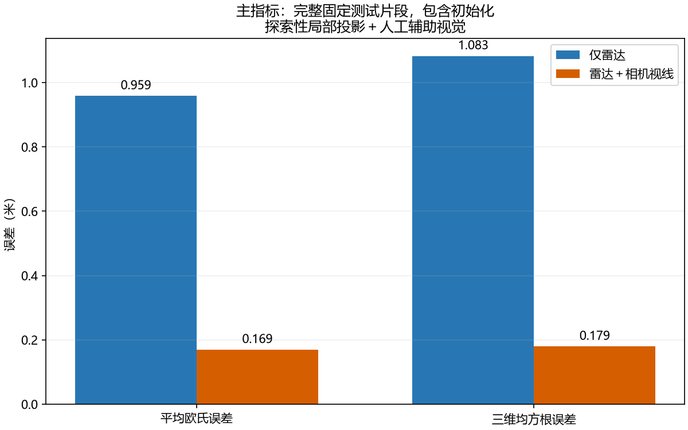
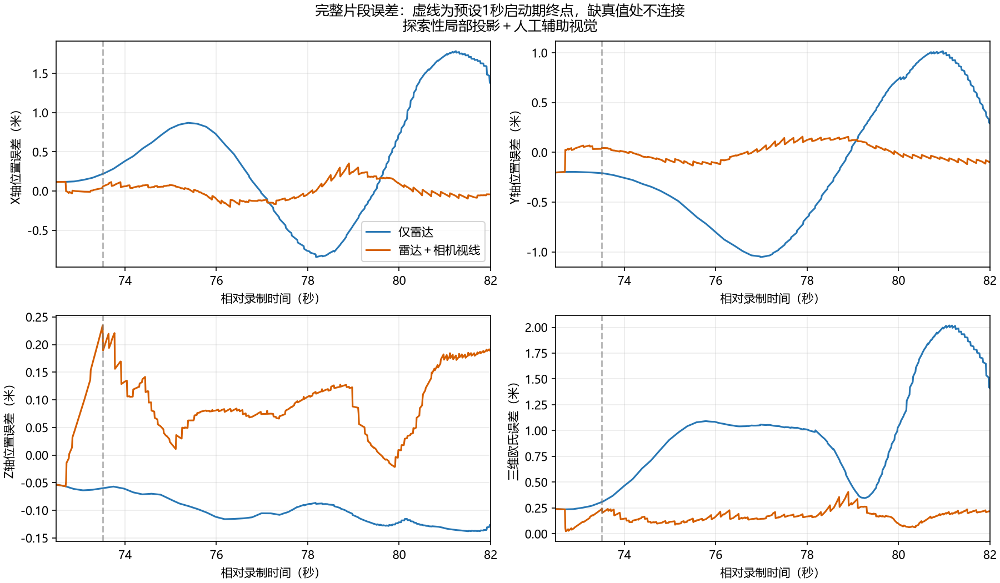
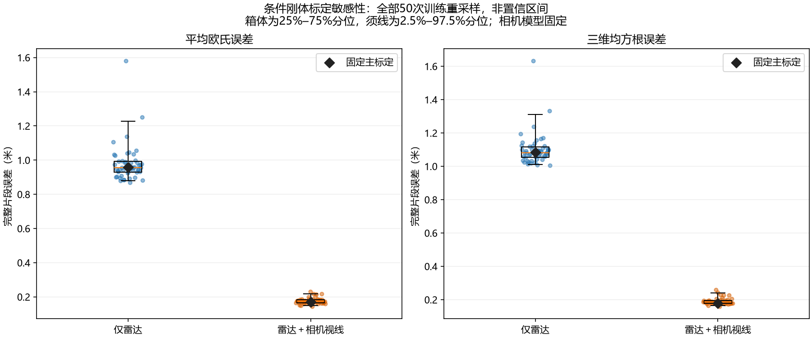

# 版本1.6真实短片段结果与解释

本版完成MMAUD V1 Mavic3固定9.5秒片段的“仅雷达”和“雷达＋相机视线”真实输入对照。**条件是人工辅助视觉＋独立训练GT监督的局部虚拟针孔投影，属于标定受限的探索性评价。** 本项目仍是独立论文适配实现，不是作者官方代码或完整硬件复现。

测试范围在任何误差计算前根据目标可见性、雷达覆盖和真值连续性确定；未按最终误差裁剪。48张真实图像中47张在初始化之后，97次去重雷达快照中首点只用于初始化，其余96次线性更新。有效输出949点采用两组共同100 Hz网格，Leica段内46个真实参考采样加两端包围样本支持插值，匹配覆盖率100%。

| 指标（完整有效输出，含初始化） | 仅雷达 | 雷达＋相机视线 |
|---|---:|---:|
| 平均欧氏误差（米） | 0.958524 | 0.169334 |
| 三维均方根误差（米） | 1.082765 | 0.179381 |
| 中位欧氏误差（米） | 1.009071 | 0.166823 |
| 95%分位欧氏误差（米） | 1.957383 | 0.272854 |
| X轴均方根误差（米） | 0.855900 | 0.112015 |
| Y轴均方根误差（米） | 0.655160 | 0.085319 |
| Z轴均方根误差（米） | 0.102856 | 0.111135 |

在这组固定参数与输入条件下，三维RMSE下降约83.4%，平均欧氏误差下降约82.3%。主要改善是相机视线约束下的横向跟踪；Z轴误差略增，相机没有提供独立深度。启动一秒后补充RMSE为雷达1.141377米、融合0.181338米，说明主收益不是仅靠启动样本。

## 标定扰动下的结果

雷达—Leica刚体训练重采样旋转不稳定，因此固定主模型之外，完整评估50个训练重采样变换。每次同步重组成相机到雷达的变换，并给两组使用同一个真值逆变换；禁止为每个方法分别优化对齐。其他参数、测试范围、K和相机到参考坐标的模型均固定。

50/50次融合平均欧氏误差及RMSE都低于仅雷达。三维RMSE的2.5%–97.5%分位为仅雷达1.009793–1.311943米、融合0.164038–0.240035米。全部draw的仅雷达状态、协方差和时间分区与主结果逐值相同；雷达评价误差改变来自共同参考坐标链的变化。

这些draw来自同一训练数据重采样，不能称作50次独立测试，也不能把分位区间当作精度置信区间。相机、时间偏差及相关联合误差未重采样，结果仅说明本片段的收益在已测试的条件刚体扰动下仍存在。

## 尚未验证的部分

- 官方完整K/D及相机—雷达—Leica物理坐标链未取得，当前模型是训练GT监督的局部虚拟映射；目标运动和观察角范围有限，不证明全视场有效。
- 人工辅助机身中心不等于作者MobileNet检测输出，也不一定等于Leica棱镜或雷达散射中心；还需真实检测器和参考点偏移验证。
- 增强点云含相关历史回波和训练时滞迹象；已去除精确重复但没有把所有剩余点当作独立原始测量，也没有以拟合时滞冒充时钟校正。原始雷达输入、硬件同步资料缺失，可能改变基线和收益幅度。
- 使用测试前后两段独立训练数据属于离线非因果标定。测试GT未进入初始化、关联、标注或调参，但训练GT用于投影/坐标链/噪声拟合，必须保留此监督条件。
- 本数据是地面固定传感器观测无人机，不能据此验证2.0的移动自机补偿或完整空对空融合。

下一步可优先补齐官方数字标定与原始雷达，在更长、不同距离/角度的保留片段和真实检测输出下复测。当前1.6的短片段探索性对照已完整记录，不把后续缺口写成已完成的硬件复现。

全部详细指标/协方差/更新见[主报告](../output/v16_comparison/report.md)和[指标数据](../output/v16_comparison/metrics.json)，扰动逐项结果见[敏感性报告](../output/v16_comparison/sensitivity_report.md)。运行入口及获取/恢复方法见[运行说明](v1_6_run.md)，各阶段工作见[版本进度](v1_6_progress.md)。
