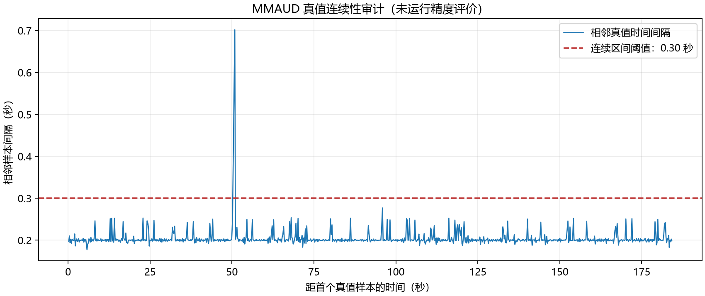

# 实际真值文件审计

来源：[MMAUD官方页面](https://ntu-aris.github.io/MMAUD/)，Mavic3独立真值bag。真值只供评价，未输入跟踪器。原始bag和提取CSV位于本地忽略目录。

SHA-256：`c8e2adfb3528ce93dd2c37fe2ccf9a3853108a26bfee04845b78695f87cb0cf3`；158,950字节。

实际相对位置样本904个，跨度184.208秒，名义约5 Hz。最大相邻间隔0.701923秒。官网321.1秒是传感器序列标称时长，独立真值覆盖实际较短，不能假设全程有真值。

| 连续区间开始时间（Unix秒） | 结束时间（Unix秒） | 样本数 |
|---:|---:|---:|
| 1692846880.473574 | 1692846930.628962 | 248 |
| 1692846931.330885 | 1692847064.681776 | 656 |

连续区间以相邻间隔≤0.30秒定义，仅用于覆盖审计。后续评价必须记录实际插值阈值，禁止跨过缺口或外推。

`/leica/point/absolute`与`relative`都声明`world`，但这不足以证明与雷达或相机同坐标。`/tf`仅有随目标运动的`world→leica_abs`、`world→leica_rel`，旋转恒为单位，不能把它们当作传感器外参。棱镜位置与机身回波/图像框中心参考点也需另行说明。

