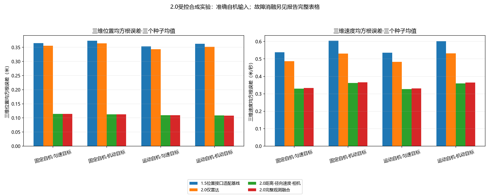
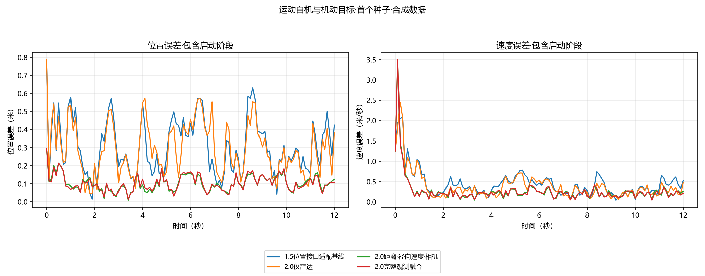

# 2.0第1阶段：运动平台融合原型

**数据性质：合成；自机输入为准确的合成先验。**
本报告不代表真实视频检测、真实飞行定位精度或设备实时性能。

四种场景、3个种子、五种配置，共60组实验；启动阶段保留。
每组使用同一噪声观测、时序、首个雷达初始化；目标真值只生成观测和事后评价，不传给track函数。

| 场景 | 配置 | 位置均方根误差（米） | 速度均方根误差（米/秒） | 拒绝观测数（所有种子） |
|---|---|---:|---:|---:|
| 固定自机·匀速目标 | 1.5位置接口适配基线 | 0.3649 | 0.5385 | 0 |
| 固定自机·匀速目标 | 2.0仅雷达 | 0.3560 | 0.4868 | 5 |
| 固定自机·匀速目标 | 2.0距离·径向速度·相机 | 0.1139 | 0.3297 | 2 |
| 固定自机·匀速目标 | 2.0完整观测融合 | 0.1140 | 0.3336 | 6 |
| 固定自机·匀速目标 | 固定自机状态（故障消融） | 0.1140 | 0.3336 | 6 |
| 固定自机·机动目标 | 1.5位置接口适配基线 | 0.3735 | 0.6042 | 0 |
| 固定自机·机动目标 | 2.0仅雷达 | 0.3639 | 0.5311 | 6 |
| 固定自机·机动目标 | 2.0距离·径向速度·相机 | 0.1128 | 0.3614 | 3 |
| 固定自机·机动目标 | 2.0完整观测融合 | 0.1129 | 0.3659 | 5 |
| 固定自机·机动目标 | 固定自机状态（故障消融） | 0.1129 | 0.3659 | 5 |
| 运动自机·匀速目标 | 1.5位置接口适配基线 | 0.3531 | 0.5355 | 0 |
| 运动自机·匀速目标 | 2.0仅雷达 | 0.3432 | 0.4832 | 5 |
| 运动自机·匀速目标 | 2.0距离·径向速度·相机 | 0.1096 | 0.3275 | 2 |
| 运动自机·匀速目标 | 2.0完整观测融合 | 0.1094 | 0.3313 | 5 |
| 运动自机·匀速目标 | 固定自机状态（故障消融） | 7.3200 | 1.3540 | 3 |
| 运动自机·机动目标 | 1.5位置接口适配基线 | 0.3624 | 0.6024 | 0 |
| 运动自机·机动目标 | 2.0仅雷达 | 0.3516 | 0.5313 | 6 |
| 运动自机·机动目标 | 2.0距离·径向速度·相机 | 0.1084 | 0.3600 | 3 |
| 运动自机·机动目标 | 2.0完整观测融合 | 0.1081 | 0.3643 | 4 |
| 运动自机·机动目标 | 固定自机状态（故障消融） | 7.1535 | 1.3334 | 4 |

## 怎样理解对照

- 1.5位置接口适配基线使用原Kalman3D及测得的雷达XYZ，经当前自机坐标变换；没有给它伪造全局vx。它没有相机和Doppler，不能把与完整观测方法的差异全部归因于滤波器改进。
- 1.5适配基线不使用NIS门控；2.0使用按维数指定的99%阈值。基线仍记录每次更新的创新、NIS和实际接受数。
- 2.0仅雷达与完整观测方法使用相同EKF、过程噪声和初值，比较增加二维相机信息的影响。
- 距离·径向速度·相机配置仅在初始化使用首个雷达方向；之后不用雷达角度，检查相机方位可提供的约束。
- 固定自机状态是显式故障消融，用于说明遗漏自机运动的后果，不能作为算法优越性的主要基线。
- 1.5离散Q与2.0连续Q不同；示例只匹配固定0.1秒时速度扩散量。完整1.5流程仍由冻结版本单独保存。

## 当前限制

观测同步10 Hz，只有一个目标；无点云关联、视频检测、延迟、掉帧、长时间导航漂移。
运动自机实验仅改变平移和偏航；三轴旋转与杆臂的几何正确性另由数学测试核验。
目标机动与常速度模型存在偏差，因此NIS/NEES是诊断数值，不据此宣称统计一致性。
原型使用首个雷达观测起轨，尚无多帧起轨确认、误起轨删除或搜索策略。
准确自机是受控上界；未来必须加入真实VIO/GNSS状态、测量时刻插值、共享相关误差、标定与实测评价。

指标和轨迹：metrics.json、states.csv、innovations.csv；states_covariances.npz保存所有实验的完整状态与协方差。
CSV相对位置以自机机体原点为参考；相对速度为Rᵀ(v目标-v自机)，与旋转机体系位置导数不同，后者还需减ω×相对位置。
主图比较四个正常配置；故障消融在上述完整表格和原始结果中保留。机器字段保持稳定，图表标注使用中文。

